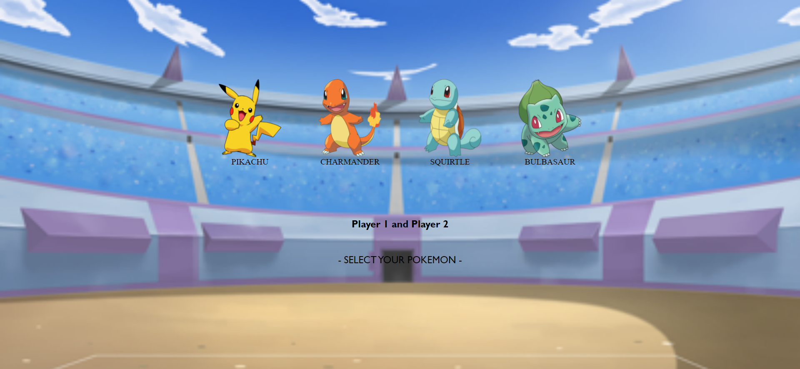

## POKEMON BATTLE FRONTIER

:wave: Soy Raquel Moya. 
:computer: Soy una estudiante de FSD en <kbd>⇥</kbd>  

### Sobre el proyecto

Este proyecto consiste en la creación de una SPA (Single Page Aplication) utilizando únicamente HTML, CSS y Javascript.

Para ello, hemos dividido el juego en 4 pantallas diferentes:

En la screen 1 vemos el logo del nombre del juego, y para pasar a la screen 2 debemos hacer click en la pantalla.

En la screen 2 tenemos la selección de personajes. Debemos clickar primero sobre el seleccionado para el player 1, y después clickar sobre otro distinto para seleccionar el de player 2. 

Como podemos ver, los personajes seleccionados aparecen deshabilitados para que ambos players no puedan seleccionar el mismo. En la parte inferior aparecen los nombres de los seleccionados (a la izquierda, player 1; a la derecha, player 2). Una vez completada la selección, cambia automáticamente de pantalla a screen 3.

La screen 3 es la pantalla donde tiene lugar la batalla. Tenemos a la izquierda el personaje seleccionado por player 1, y a la derecha el personaje seleccionado por player 2. Cada uno con su correspondiente vida en la parte inferior.
En el centro tenemos un botón sobre el que debemos clickar para generar la batalla. Al clickar, la vida de ambos personajes se ve afectada por un ataque random. 

Al llegar la vida de alguno de ellos a 0, se da por finalizada la batalla y se cambia automáticamente a la screen 4.

En esta pantalla se muestra quién es el ganador y el personaje con el cual ha ganado. 

Si volvemos a clickar sobre la pantalla, volveremos a la screen 1 y podremos reiniciar el juego.

### Hecho con

Para la realización de este proyecto, se han usado las siguientes tecnologías:  

 

Puedes ver este proyecto en: <kbd>⇥</kbd> [GitHub pages](https://raquelmoya.github.io/JSGame)

### Créditos

Autor: RaquelMoya

Última edición: 10/02/2022
